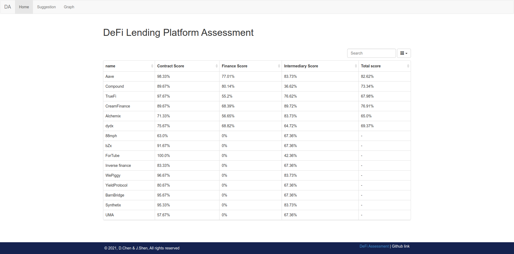

# DeFi Assessement (dass)

A prototype project to perform risk assessment on different DeFi lending platforms.

<!-- @import "[TOC]" {cmd="toc" depthFrom=1 depthTo=6 orderedList=false} -->

<!-- code_chunk_output -->

- [DeFi Assessement (dass)](#defi-assessement-dass)
  - [Overview](#overview)
  - [Installation](#installation)
  - [Usage](#usage)
    - [Data collection](#data-collection)
    - [Data process](#data-process)
    - [Model Training](#model-training)
    - [Web Application](#web-application)
  - [Contributors](#contributors)

<!-- /code_chunk_output -->

## Overview



## Installation

```shell
pip3 install .
```

## Usage

This project is packed into a command-line tool with 4 subcommand:

```shell
Usage: dass [OPTIONS] COMMAND [ARGS]...

Options:
  --help  Show this message and exit.

Commands:
  data     Collect raw data.
  process  Process the data related to smart contracts.
  train    Train models.
  web      Create a simple local website to view the result.
```

### Data collection

`data` command is used to collect data for training and assessment (prediction). All of the other three commands are dependent on it. Make sure to run this command at beginning.

The workflow of the 4 commands should be:

```shell
data -> process -> train -> web
```

### Data process

`process` command is aimed to process raw data. Currently, only sart contract data need to be processed after collection.

### Model Training

`train` command is simple. It trains 2 models. One for smart contracts and the other for financial risks.

### Web Application

`web` command builds a local web interface for users to directly view the result of assessement.

## Contributors

<a href="https://github.com/yuukidach/DeFi-Assessment/graphs/contributors">
  
</a>
